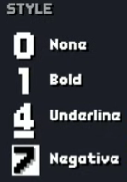
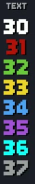
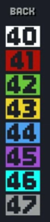
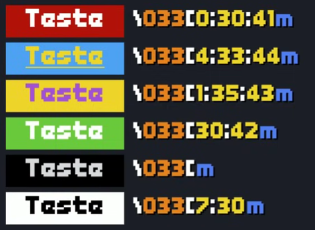

# **TERMINAL COLORS**
Its possible use the colors in terminals using Python language through use of the standard ANSI - escape sequence
## ANSI FOR COLORS
The patterns starts with ```"\"``` and then code (033)
example:
```
\033[m

```
between "[" and "m" you insert ```styles```, ```text``` and ```backgroud```
>[!NOTE]
>It is not mandatory to enter the codes

### ***Style***
The code represents the behavior
Codes examples:


### ***Text***
Represent the color text
Codes examples:


### ***Background***
Represent the background color


#### APLICATIONS
```
\033[0;30m #The style none and the text color red
\033[1;32;43m #the style bold, the text color green and the background color yellow
\033[4;34;40m #the style underlined, the text color blue and the background color white
\033[7;31;46m #inverts colors values, text color ↔️ background color
```


>[!NOTE]
>To limit the size of the background padding, use \033[m after the text.
>example:
>```\033[0;30mOlá, mundo!!!\033[m```
